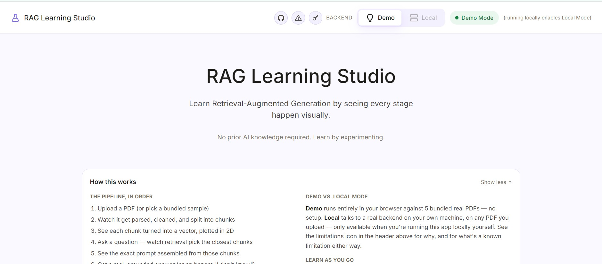
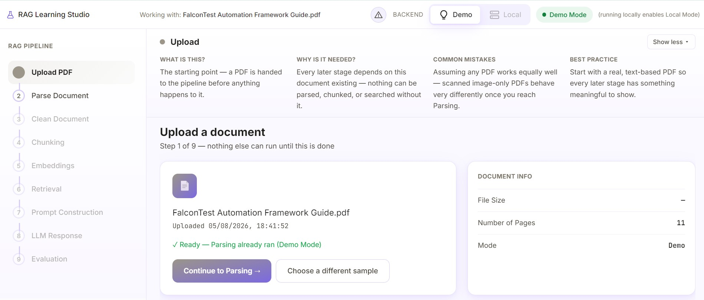
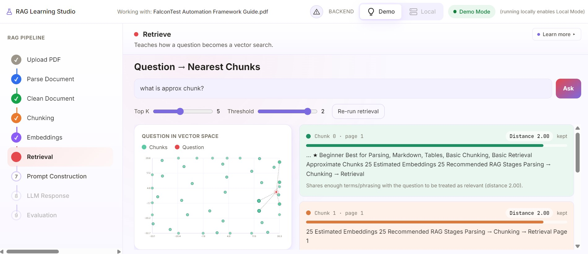
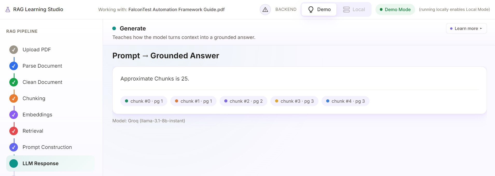

# RAG Learning Studio

**Understand • Evaluate • Test • Benchmark Retrieval-Augmented Generation**

RAG Learning Studio is an interactive playground that shows every transformation a
document goes through on its way to becoming an answer — parsing, cleaning,
chunking, embedding, retrieval, prompt assembly, generation, and evaluation
— using real data from a real pipeline, not a diagram.

A local, privacy-friendly Python RAG pipeline (`backend/`) is paired with an
educational React frontend (`frontend/`) that visualizes each stage,
explains what happened and why, and lets you change parameters and watch
the effect ripple through downstream stages in real time.

<table>
  <tr>
    <td></td>
    <td></td>
  </tr>
    <tr>
    <td></td>
    <td></td>
  </tr>
</table>


---

## Why this exists

**This is not another Chat-with-PDF app.** Plenty of those exist, and
building one isn't the goal here.

RAG Learning Studio exists because most people using Retrieval-Augmented Generation
treat the pipeline as a black box: a document goes in, an answer comes out,
and when the answer is wrong, there's no visibility into *which stage*
failed or *why*. Was it a bad chunk boundary? A retrieval threshold set too
strict? A parser that silently dropped a table? Without seeing the
intermediate stages, debugging a RAG system is guesswork.

This project is closer to a **debugger for RAG** than an application built
on top of RAG. Every stage's real intermediate output is captured and shown
— nothing is hidden, nothing is simulated, and when something isn't
implemented yet, the UI says so honestly instead of faking a number (see
[Known limitations](#known-limitations)).

It's built for:

- **Developers learning RAG** — see what a chunk boundary actually looks
  like, what an embedding actually is, why retrieval sometimes returns
  nothing.
- **Engineers debugging a RAG system** — experiment with chunk size,
  overlap, top-k, and similarity threshold against real documents and see
  the downstream effect immediately.
- **Anyone teaching or explaining RAG** — a working, inspectable pipeline
  is a better explanation than a slide.

---

## Features

| Stage | What it shows |
|---|---|
| **Upload** | A real PDF (or a bundled sample) enters the pipeline. |
| **Parse** | The real parsed document, side by side with the original PDF, with detected headings/images/tables annotated inline. |
| **Clean** | Exactly what whitespace normalization changed — or an honest "nothing to clean" state when a document needed none. |
| **Chunk** | Every chunk boundary, colored and explorable, with real overlap regions shown between adjacent chunks and live re-chunking as you adjust size/overlap. |
| **Embed** | A real 2D projection of chunk embeddings, with the real vector preview for any selected chunk. |
| **Retrieve** | A real question turned into a vector search, with kept vs. dropped candidates, similarity scores, and a diagnosis panel when nothing clears the threshold. |
| **Prompt** | The exact assembled prompt sent to the model, section by section, color-linked back to its source chunk. |
| **Generate** | A real, grounded answer — or a real, honest abstention when nothing in the retrieved context supports one. |
| **Evaluate** | A scorecard for the run. Marked "coming soon" today rather than filled with fabricated metrics — see [Roadmap](#roadmap--milestones). |

Every stage is driven by real parameters you can change (chunk size,
overlap, top-k, similarity threshold), with the effect visible immediately
in the same view — not a separate settings page.

---

## Architecture

```
                 ┌──────────────────────┐
   PDF  ───────▶ │   backend/ (Python)   │
                 │   FastAPI HTTP layer  │
                 │   over a real RAG     │
                 │   pipeline            │
                 └───────────┬───────────┘
                             │ real HTTP (Local Mode)
                             ▼
                 ┌──────────────────────┐
                 │   frontend/ (React)   │
                 │   nine-stage pipeline │
                 │   viewer               │
                 └──────────────────────┘
                             ▲
                             │ in-browser mock adapter (Demo Mode)
                             │ — no backend required
                 ┌───────────┴───────────┐
                 │  bundled sample PDFs   │
                 └────────────────────────┘
```

The frontend is deliberately **framework-agnostic**: every component is
written against a plain domain model (`frontend/src/types/pipeline.ts`),
never against a specific RAG framework, vector database, or model
provider. Two interchangeable data sources implement that model —
`mockPipelineDataSource.ts` (Demo Mode, runs entirely client-side) and
`httpPipelineDataSource.ts` (Local Mode, talks to `backend/api.py`) — so
the same UI works identically whether real data is coming from your own
backend or from a bundled sample. See
[`docs/architecture-diagram.md`](docs/architecture-diagram.md) for the full
data-flow diagram.

The backend (`backend/src/trace.py`) calls the real pipeline stage by
stage — parse (`pymupdf4llm`), clean, chunk (LangChain text splitters),
embed (Hugging Face sentence-transformers), retrieve (Chroma), and
generate (Ollama by default, Anthropic optionally) — and records exactly
what each stage produced. `api.py` does nothing but serialize that trace
over HTTP.

---

## Demo Mode vs. Local Mode

RAG Learning Studio runs two ways, switchable live from the app itself:

| | **Demo Mode** | **Local Mode** |
|---|---|---|
| Backend required? | No | Yes (`backend/`, running locally) |
| Data | 4-document benchmark suite (real PDFs, fictional content) | Any PDF you upload |
| Parsing / chunking / embedding | Real logic, runs in your browser | Real logic, runs in your own backend process |
| Generation | A real LLM call via a server-side proxy (or your own API key — see below), or an honest extractive stand-in if neither is available, clearly labeled | A real LLM call via your configured provider (Ollama by default) |
| Upload your own PDF | Disabled — Demo Mode's samples are fixed, so an "uploaded" file would be silently ignored rather than actually processed. Better to disable it than to have a control that looks like it works and doesn't. | Enabled — only when this app itself is running locally too (see below) |

**Local Mode only works when this app is running locally.** A hosted
deployment can't reach a random visitor's own machine, so the Local
toggle is disabled outright on any hosted deployment and only enabled on
`localhost`/`127.0.0.1` — run the app yourself (`npm run dev`) to use it.

**Real LLM generation in Demo Mode, without exposing a key.** Demo Mode's
Generate stage can produce a real LLM answer two ways: a server-side
proxy (`api/generate.js`, deployed as a Vercel Serverless Function) that
holds a default key server-side only, or your own Groq key entered via
the LLM settings control (key icon, top right of any page) — stored only
in that browser tab, sent only to Groq directly, never to this app's own
server. Neither key is ever visible client-side in the way a `VITE_`-
prefixed variable would be — see [Deployment](#deployment) below.

**Why sample documents instead of upload in Demo Mode?** Demo Mode is
designed to work with zero setup — no backend, no API key, no network
call required to see the whole pipeline. The five bundled documents were
each chosen to exercise a different real challenge (see
[Sample documents](#sample-documents) below) rather than being arbitrary
filler text, so switching to Local Mode isn't required to see meaningful,
varied pipeline behavior.

**Infrastructure limitation, stated plainly:** Demo Mode's embedding and
chunking logic runs entirely in the browser and is genuinely real, but it
is not the same production-grade stack as the backend (no Chroma, a
lighter embedding approach). It's built to be honestly representative of
the *shape* of each stage, not a claim that it's numerically identical to
what `backend/` produces on the same document. If you need the real
production stack's exact numbers, use Local Mode.

---

## Installation

You need two terminals to run both halves together. Demo Mode alone needs
only the frontend terminal.

### Prerequisites

- **Node.js 18+** (for the frontend)
- **Python 3.11+** (for the backend, Local Mode only)
- **Ollama** running locally with a model pulled — the default LLM
  provider (Local Mode only; skip this entirely for Demo Mode)

### Terminal 1 — backend (skip for Demo Mode only)

```bash
cd backend
pip install -e .
# or, if you use uv: uv sync

# Default LLM_PROVIDER is "ollama" — make sure it's actually running:
ollama serve &
ollama pull llama3.2   # or whatever config.py's OLLAMA_MODEL_NAME is set to

uvicorn api:app --reload --port 8000
# or, if you use uv: uv run uvicorn api:app --reload --port 8000
```

Confirm it's up: `curl http://localhost:8000/api/health` should return
`{"status":"ok","activeRuns":0}`.

### Terminal 2 — frontend

```bash
cd frontend
npm install
cp .env.example .env.local
npm run dev
```

Open the printed local URL. The app starts in **Demo Mode** by default —
no further setup needed. To switch to Local Mode, use the Backend toggle
on the Dashboard (it'll connect to the backend started above
automatically), or set in `.env.local`:

```
VITE_PIPELINE_DATA_SOURCE=http
VITE_API_BASE_URL=http://localhost:8000/api
```

### Troubleshooting

| Symptom | Likely cause |
|---|---|
| Local Mode stays on "Trying to connect…" for a long time | Normal on first start — loading the embedding model's weights can take 15-45 seconds. It'll switch to "Connected" automatically once ready, or fall back to Demo Mode with a visible notice after 60 seconds. |
| `ollama: command not found` | Ollama isn't installed. Install it from [ollama.com](https://ollama.com), or switch `config.py`'s `LLM_PROVIDER` to `"anthropic"` and set `ANTHROPIC_API_KEY` instead. |
| Frontend shows a blank page | Run `npm run typecheck` in `frontend/` — a type error will show up there before it shows up as a blank page. |
| CORS error in the browser console | The backend's `allow_origins` in `api.py` only allows the Vite dev server's default ports (`5173`). If you've changed the frontend's port, update that list. |

---

## Deployment

The frontend deploys free on Vercel. Local Mode is unaffected either way
— it never leaves `localhost`.

1. Deploy `frontend/` as a Vercel project (static build + the
   `api/generate.js` Serverless Function are both picked up
   automatically — no extra config).
2. In the Vercel dashboard, **Project Settings → Environment
   Variables**, add `GROQ_API_KEY` (get one free at
   [console.groq.com/keys](https://console.groq.com/keys)) — **not**
   prefixed with `VITE_`. A `VITE_`-prefixed variable gets compiled
   directly into the public client bundle, defeating the entire point;
   a plain `GROQ_API_KEY` is only ever readable from inside the
   serverless function itself.
3. That's it — Demo Mode's Generate stage now produces real answers for
   every visitor, without any of them ever seeing the key.

Visitors can also add their own Groq key instead (LLM settings, key icon
in the header) — stored only in their own browser tab, used only to call
Groq directly, and completely independent of the step above.

If no key is configured either way, Generate still works — it falls back
to an honest, clearly-labeled extractive stand-in rather than failing or
pretending to be a real model.


```
rag-learning-studio/
├── backend/               Python RAG pipeline + FastAPI HTTP layer
│   ├── config.py          All tunables in one place
│   ├── api.py             The HTTP layer
│   ├── main.py            CLI (ingest/query), independent of the API
│   ├── src/                parse → clean → chunk → embed → retrieve → generate
│   └── verification/      Offline, network-free test harness (stubbed deps)
├── frontend/              React + TypeScript learning UI
│   ├── src/types/          The framework-agnostic domain model
│   ├── src/services/       PipelineDataSource adapters (mock + http)
│   ├── src/components/     Layout, shared components, and one page per stage
│   └── public/samples/     The 5 bundled real sample PDFs
├── docs/                  Architecture diagram, screenshots, demo placeholders
├── ROADMAP.md             Version-by-version plan
├── CONTRIBUTING.md        Ground rules + how to contribute to either half
└── TESTING.md             How to test both modes locally
```

---

## Technologies used

| | |
|---|---|
| **Frontend** | React 18, TypeScript (strict mode), Vite, Tailwind CSS, react-router, pdf.js |
| **Backend** | Python 3.11+, FastAPI, LangChain, Chroma (vector store), sentence-transformers (embeddings), pymupdf4llm (parsing), Ollama or Anthropic (generation) |

---

## Sample documents

Demo Mode ships a 4-document benchmark suite — fictional company/product
names, purpose-built as safe, license-free RAG test material, not real-world
documents pulled from anywhere. Each one self-reports its own difficulty
(Beginner through Expert) and what it's specifically built to exercise,
right on its own first page:

| Document | Difficulty | What it's built to demonstrate |
|---|---|---|
| **FalconTest Automation Framework Guide** | ★ Beginner | Clean, well-structured product docs — headings, config tables, code blocks. A good baseline before the harder ones. |
| **APIVerify Integration Handbook** | ★★ Intermediate | Longer explanations that deliberately continue across a page break — tests chunk overlap and multi-chunk synthesis. |
| **AI Testing & RAG Playbook** | ★★★ Advanced | Figures, diagram placeholders, cross-references ("see Appendix A"), and appendices outside the normal heading sequence — built specifically to stress parsing. |
| **Engineering Standards Manual** | ★★★★ Expert | Superseded-vs-current policy pairs, a duplicated appendix, a genuinely scanned page with real OCR noise, and questions with no answer anywhere in the text. |

See `frontend/src/services/fixtures/sampleDocuments.ts` for the full text
and metadata, and `frontend/public/samples/` for the real PDF files
themselves.

---

## Known limitations

Stated plainly, because they matter once you're looking at your own
documents instead of a bundled sample — and because demonstrating these
limitations honestly is itself part of what this project is for:

- **The parser is intentionally simple.** `pymupdf4llm` handles clean,
  text-based, single-column PDFs well. It does **not** perform OCR, so
  scanned/image-only PDFs will parse to little or no text — the
  "Engineering Standards Manual" sample includes a genuinely scanned page
  with real OCR noise ("con figuration," "rninimum") to show this
  honestly. Figures, cross-references, and appendices outside the normal
  heading sequence (see the "AI Testing & RAG Playbook" sample) may also
  parse imperfectly or lose structure. This is a deliberate scope choice,
  not an oversight — a naive parser's real failure modes are themselves a
  useful thing to see and understand, and are exactly the kind of "why
  did this stage behave this way" question this project exists to make
  visible.
- **Each stage shows one basic strategy, not the only or the production
  one.** One parser, one whitespace-normalization pass for cleaning, one
  chunking method (recursive character splitting), one retrieval approach
  (dense vector similarity — no hybrid/keyword search, no re-ranking). A
  production RAG system commonly runs several of each — an OCR fallback
  chain, multi-stage cleaning, more than one chunking strategy depending
  on document type, hybrid or re-ranked retrieval, caching at multiple
  layers. Nothing here should be read as "this is how chunking works" or
  "this is how cleaning is done" — it's one clear reference implementation
  per stage, chosen to teach the concept, not a claim that it's standard
  or the only approach.
- **Faithfulness and Answer Relevance scoring aren't implemented yet.**
  The Evaluate stage is honestly marked "coming soon" rather than showing
  a fabricated number — this is the next major milestone (see
  [Roadmap](#roadmap--milestones)).
- **Citation highlighting is approximate.** Since a real LLM's answer is
  abstractive prose (not a verbatim excerpt), citations point to the
  contributing chunk rather than a precise character range within it.
- **Not built for production hosting as-is.** The backend keeps runs in
  an in-memory store, has no auth or rate limiting, and hardcodes CORS to
  `localhost`. Fine for local, single-user use; see `ROADMAP.md`'s "Before
  hosting this anywhere" section before deploying it publicly.

---

## Roadmap & milestones

The project evolves one version at a time: **Understand → Evaluate → Test →
Benchmark.** Detail is intentionally light past the version underway —
committing to a shape for something years out would be exactly the
over-commitment this roadmap tries to avoid.

1. **Understand & Visualize** *(this release, complete)* — the full
   nine-stage pipeline, real data, real parameters, every transformation
   visible.
2. **Evaluate** — real Faithfulness / Answer Relevance / Context Recall
   scoring, cost estimation, history across runs.
3. **Test** — regression testing against a fixed set of question/expected-
   answer pairs, automated re-runs when pipeline parameters change.
4. **Benchmark** — formal comparison across embedding models, retrievers,
   and chunking strategies, built on whatever V2/V3 actually produce.

Everything past that — named parameter experiments, hybrid search,
reranking, agentic RAG — is a real idea, not yet a version; see
`ROADMAP.md`'s "Later, unscheduled" section.

Deliberately **not** on the roadmap: authentication, billing, multi-tenant
dashboards, or other generic SaaS features. Every roadmap item earns its
place by teaching a concept, explaining a decision, helping debugging, or
improving experimentation — see `ROADMAP.md`'s "scope discipline" note.

Full version-by-version detail lives in [`ROADMAP.md`](ROADMAP.md).

---

## Contributing

See [`CONTRIBUTING.md`](CONTRIBUTING.md) — covers ground rules, repo
layout, and how to contribute to either half. Good first issues are listed
there too.

## Testing

See [`TESTING.md`](TESTING.md) for the full walkthrough of both Demo Mode
and Local Mode, plus the offline verification harnesses
(`frontend/verification/`, `backend/verification/`) that catch real bugs
without needing network access.

## License

[MIT](LICENSE).
