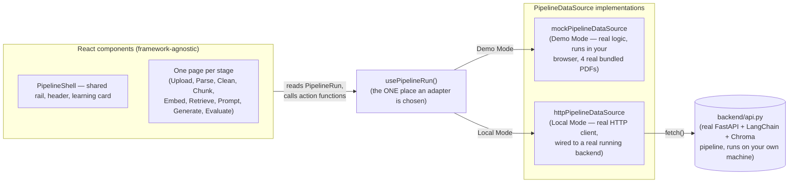
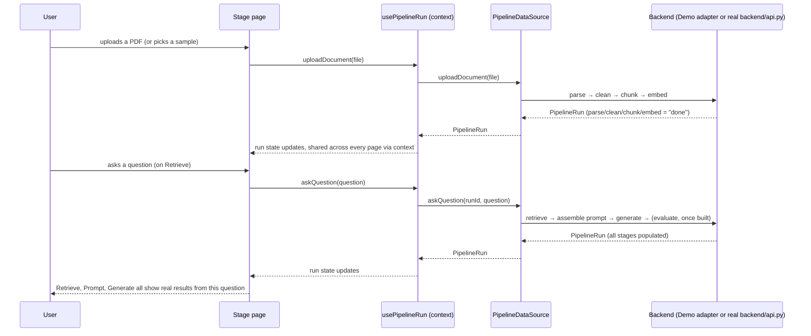

# Architecture

## Why a framework-agnostic pipeline model

RAG can be built with LangChain, LlamaIndex, Haystack, a hand-rolled script, or
something that doesn't exist yet. This frontend refuses to know which one is
behind it. Every component is written against the types in
[`src/types/pipeline.ts`](../src/types/pipeline.ts) — `Chunk`, `RetrievalCandidate`,
`PromptAssembly`, and so on — which describe concepts every RAG implementation
shares, not the API shape of any particular library.

The only place that's allowed to know how those types get filled in is a
**`PipelineDataSource`** adapter (see
[`src/services/pipelineDataSource.ts`](../src/services/pipelineDataSource.ts)).
Swapping the backend from, say, a LangChain + Chroma implementation to a
LlamaIndex + Pinecone implementation should mean writing one new adapter file —
zero changes to any component.

**On the word "mock":** `mockPipelineDataSource.ts` is Demo Mode's adapter,
and the name is a holdover from an earlier, genuinely-fake-data version of
this project. What it does *today* is real: real parsing, real chunking,
real embedding, real vector-space math, all running client-side in your
browser against 4 real bundled PDFs — see each service file under
`src/services/` for the actual logic, not a lookup table. "Mock" here means
*"runs without a backend,"* not *"fake."* The one thing that's genuinely
simplified is the LLM step — Demo Mode calls a real model (Groq, via
`api/generate.js` or your own key) when one's available, same as Local Mode.



## The pipeline, as a funnel

Nine stages, each one narrowing or transforming what the previous stage
produced — a document funnels down to chunks, chunks funnel down to the few
that matter for one question, and those funnel down to one answer:

```
   [ Upload ]  one PDF enters
        │
   [ Parse  ]  → structured markdown (headings, tables, images noted)
        │
   [ Clean  ]  → whitespace-normalized text
        │
   [ Chunk  ]  → many overlapping pieces
        │
   [ Embed  ]  → each piece becomes a vector
        │              ┌─────────────┐
        └─────────────▶│  a question │  ← enters here, funnels down with the chunks
                        └──────┬──────┘
   [Retrieve]  → the few chunks closest to that question
        │
   [ Prompt ]  → those chunks + the question, assembled into one prompt
        │
   [Generate]  → one real, grounded answer (or an honest "no LLM available")
        │
   [Evaluate]  → (coming soon) a scorecard for that answer
```

Everything above the question line runs once per document. Everything from
Retrieve down runs once per question — you can ask several questions against
the same uploaded/parsed/chunked/embedded document without repeating the
earlier stages, which is exactly what `usePipelineRun`'s single shared `run`
object (kept in `PipelineRunProvider`'s React context) is for: each stage's
real output lives in one place, read by whichever page is currently showing
it, never re-fetched or recomputed just from navigating between stages.

## Data flow for one question



## Component structure

```
App.tsx                              — routing + PaletteProvider + PipelineRunProvider
├── PipelineShell                    — shared per-stage-page shell: header (logo, filename,
│                                       limitations, backend mode), pipeline rail, learning card
├── PipelineRail                     — left-side stage nav, derived from stageMeta.ts
├── LearningCard                     — What is this / Why / Common mistakes / Best practice,
│                                       per stage, "Learn more" to expand
└── One page per stage (components/pages/)
    ├── Dashboard                    — hero, pipeline animation, How this works, Journey Panel,
    │                                   Known limitations (expanded)
    ├── Upload                       — real POST (Local) or SampleDocumentPicker (Demo)
    ├── Parse                        — SyncedDocumentView: real PDF render (or text fallback) ↔
    │                                   annotated parsed markdown
    ├── Clean                        — real whitespace diff, or an honest "nothing to clean"
    ├── ChunkPage                    — colored chunk cards, real computed overlap seams,
    │                                   live rebuild on size/overlap change
    ├── EmbedPage                    — real 2D projection scatter + real vector preview
    ├── RetrievePage                 — question form, vector-space chart, ranked candidates,
    │                                   diagnosis panel when nothing clears the threshold
    ├── PromptPage                   — the real assembled prompt, section by section
    ├── GeneratePage                 — the real answer, or a real "no LLM available" block
    └── EvaluatePage                 — honest "coming soon" (see ROADMAP.md V2)
```

## Folder structure

```
src/
  types/pipeline.ts            the framework-agnostic domain model — read this first
  services/
    pipelineDataSource.ts      the adapter interface (the "port")
    mockPipelineDataSource.ts  Demo Mode adapter — real logic, runs in-browser (see note above)
    httpPipelineDataSource.ts  Local Mode adapter — real HTTP client, wired to backend/api.py
    embeddingProviders/         pluggable embedding backends (Demo Mode)
    llmProviders/                pluggable LLM backends (Demo Mode) — groqProvider.ts,
                                  extractiveFallbackProvider.ts
    userApiKey.ts                 the user's own BYOK Groq key, sessionStorage only
    runPersistence.ts             sessionStorage run persistence across a reload
    fixtures/sampleDocuments.ts   the 4 real sample documents' text + metadata
  hooks/
    usePipelineRun.ts          the ONE place an adapter is selected; owns run/mode state
    PipelineRunContext.tsx     lifts usePipelineRun to a shared context (app-wide, not per-page)
    PaletteContext.tsx         the active visual theme
  components/
    layout/                   PipelineShell, PipelineRail, LearningCard, BackendModeSelector
    common/                   generic reusable pieces (state blocks, icons, LimitationsPanel,
                              LLMKeySettings)
    pages/                    one file per pipeline stage, plus Dashboard
  styles/                     tokens.css (design tokens/palette), global.css
public/
  samples/                    the 4 real bundled sample PDFs
api/
  generate.js                 Vercel Serverless Function — the only place a default LLM
                               key is ever held server-side; see the root README's
                               Deployment section
```
